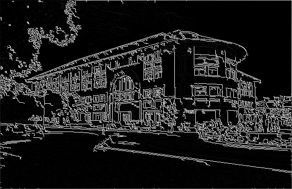

# Canny Edge Detection using Python 

Canny Edge Detection is a wonderful edge detection technique. I have implemented it from scratch. It follows a series of steps:

1. Noise Removing
2. Gradient Calculation
3. Non Maxima Suppression
4. Double Thresholding
5. Edge Tracking By Hysteresis

## Description

**canny_edge_detection.py:** This file is the main file where all the steps are performed by calling function.
**Gaussian_filter.py:** This file implement Gaussian blur filter used for noise removing.
**Sobel_filter.py:** This file implemnts sobel operator for Gradiant Calculation.
**Non_max_supression.py:** This file contains function for non maxima suppression.
**Thresholding.py:** This file implements Double Thresholding technique and also Edge tracking by hysteresis.

## Result

**Original Image**

**Output Image**
 

## Prerequisites

* python 3.7
* OpenCV >= 4
* Numpy

